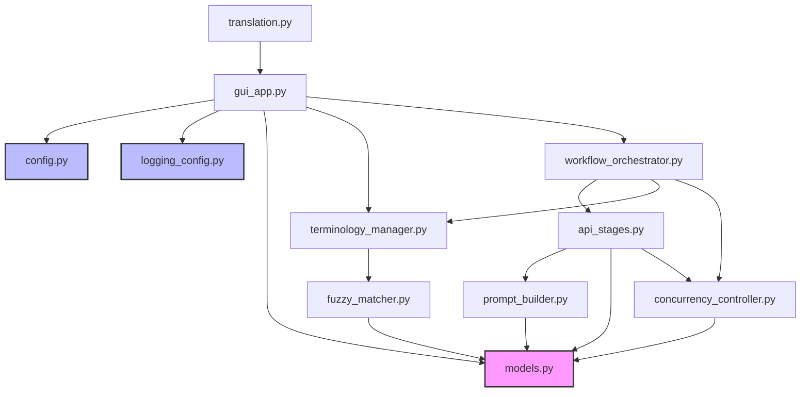

# 模块依赖关系图

## 依赖层次结构

```
Level 0 (基础层 - 无内部依赖):
├── models.py                   # 数据模型
├── config.py                   # 配置常量
├── logging_config.py           # 日志配置

Level 1 (工具层 - 依赖基础层):
├── prompt_builder.py           # → models.py
├── fuzzy_matcher.py            # (独立)
├── concurrency_controller.py   # → models.py

Level 2 (服务层 - 依赖工具层):
├── terminology_manager.py      # → models.py, fuzzy_matcher.py
├── api_stages.py               # → models.py, prompt_builder.py, concurrency_controller.py

Level 3 (编排层 - 依赖服务层):
└── workflow_orchestrator.py    # → models.py, terminology_manager.py, 
                                #    api_stages.py, concurrency_controller.py

Level 4 (应用层 - 依赖编排层):
└── gui_app.py                  # → config.py, logging_config.py, models.py,
                                #    terminology_manager.py, workflow_orchestrator.py

入口:
└── translation.py              # → gui_app.py
```

## 详细依赖关系

### models.py
- **依赖**: Python 标准库 (dataclasses, typing)
- **被依赖**: 所有其他模块

### config.py
- **依赖**: 无
- **被依赖**: gui_app.py

### logging_config.py
- **依赖**: Python 标准库 (logging, sys, tkinter)
- **被依赖**: gui_app.py

### prompt_builder.py
- **依赖**: models.py
- **被依赖**: api_stages.py

### fuzzy_matcher.py
- **依赖**: thefuzz 库
- **被依赖**: terminology_manager.py

### concurrency_controller.py
- **依赖**: asyncio, time, models.py
- **被依赖**: api_stages.py, workflow_orchestrator.py

### terminology_manager.py
- **依赖**: pandas, asyncio, copy, json, os, concurrent.futures
- **依赖**: models.py, fuzzy_matcher.py
- **被依赖**: workflow_orchestrator.py, gui_app.py

### api_stages.py
- **依赖**: openai, asyncio, json, re
- **依赖**: models.py, prompt_builder.py, concurrency_controller.py
- **被依赖**: workflow_orchestrator.py

### workflow_orchestrator.py
- **依赖**: asyncio, openai
- **依赖**: models.py, terminology_manager.py, api_stages.py, concurrency_controller.py
- **被依赖**: gui_app.py

### gui_app.py
- **依赖**: pandas, tkinter, datetime, threading, gc
- **依赖**: config.py, logging_config.py, models.py, 
         terminology_manager.py, workflow_orchestrator.py, openai
- **被依赖**: translation.py

### translation.py
- **依赖**: multiprocessing, tkinter
- **依赖**: gui_app.py

## 依赖关系可视化



## 循环依赖检查

✅ **无循环依赖** - 项目采用严格的单向依赖结构

依赖方向: `基础层 → 工具层 → 服务层 → 编排层 → 应用层`

这种设计确保了:
1. 模块可以独立测试
2. 修改底层模块不会影响高层模块
3. 易于理解和维护
